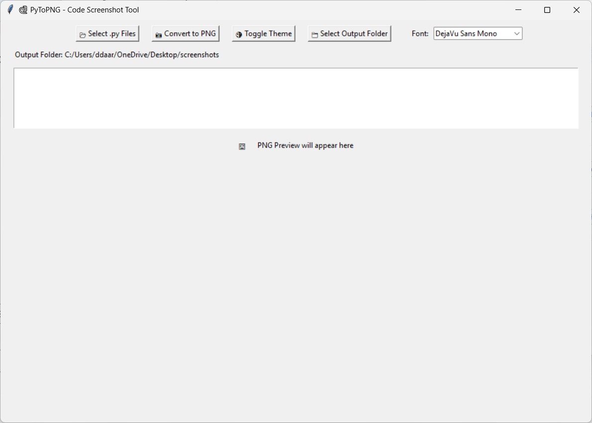

# Python-To-PNG
A standalone app that converts uploaded python code files to png format
---

**PyToPNG** is a user-friendly desktop application that converts Python `.py` files into beautifully formatted PNG images of your code, complete with syntax highlighting and line numbers. It’s ideal for sharing code snippets, creating tutorials, or saving clean screenshots of your projects.

---

## Features

* ✅ Select and convert multiple `.py` files into PNG images.
* ✅ Syntax highlighting with **Pygments**.
* ✅ Line numbers in the output images.
* ✅ Light and dark theme support.
* ✅ Custom font selection for code rendering.
* ✅ Preview the last converted image.
* ✅ Automatic saving to a default output directory.

---

## Screenshots

*APP INTERFACE*


---

*OUTPUT FOLDER CHANGE*

*(Most of the fonts may not work for all Operating Systems and their different versions. Use Courier New for the best possible results.)*

---

## Installation

### Requirements

* Python 3.8 or higher
* Pip packages:

```bash
pip install pygments pillow
```

---

### Running the App

1. Clone the repository:

```bash
git clone https://github.com/b07Aarav/PyToPNG.git
cd PyToPNG
```

2. Run the application:

```bash
python main.py
```

> Replace `main.py` with the actual script name if different.

---

## Usage

1. Click **📂 Select .py Files** to choose Python files.
2. Click **📸 Convert to PNG** to generate images.
3. Toggle **🌗 Light/Dark themes** as desired.
4. Use the **Font** dropdown to select a preferred font.
5. Preview the last converted PNG in the preview area.

By default, PNGs are saved to:

```
C:/Users/<your_username>/OneDrive/Desktop/screenshots
```

You can modify the output folder in the `output_dir` variable inside the script.

---

## Build Executable

To create a standalone Windows executable with a custom icon:

```bash
pyinstaller --onefile --windowed --icon=images.ico --name=pytopng main.py
```

* The `.exe` will appear in the `dist` folder.
* Make sure `images.ico` is in the same folder as the script.

---

## Dependencies

* [Tkinter](https://docs.python.org/3/library/tkinter.html) – GUI toolkit.
* [Pygments](https://pygments.org/) – Code syntax highlighting.
* [Pillow](https://python-pillow.org/) – Image processing.

---

## License

MIT License – see `LICENSE` file.

---

## Author

**Aarav B.**
GitHub: [b07Aarav](https://github.com/b07Aarav)
